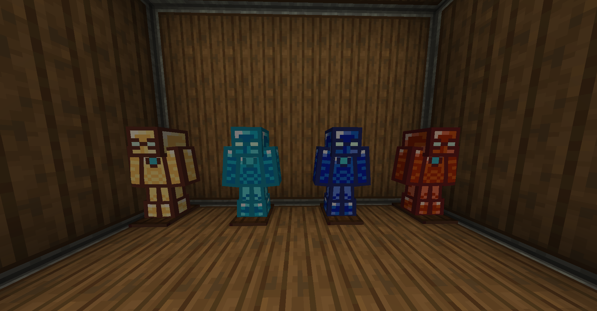
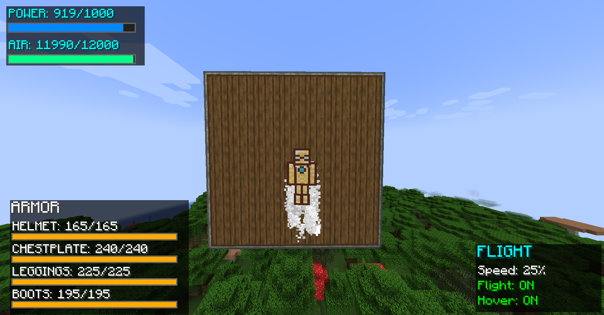
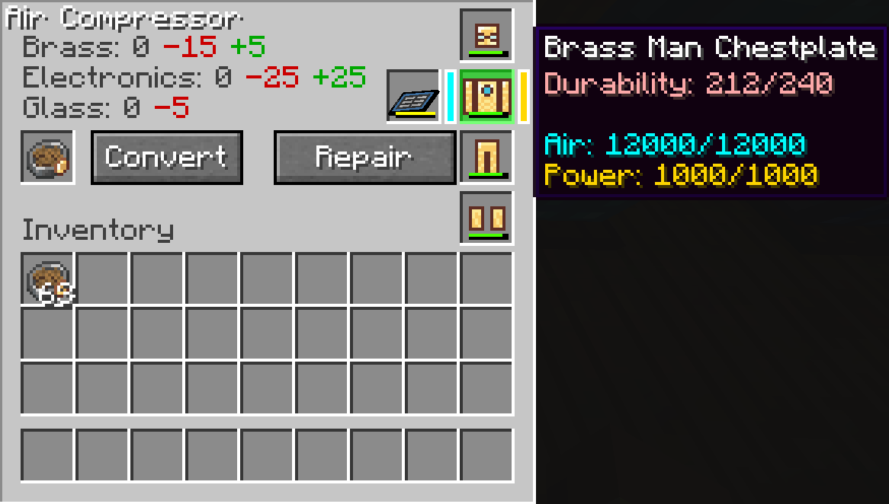

# Create: Brass Man

  

  <strong>Iron Man-inspired technology powered by Create's kinetic energy!</strong>

  
  
  

---

## 📖 Overview

**Create: Brass Man** seamlessly integrates Marvel's Iron Man technology with the mechanical world of Create. Build advanced powered armor, fly through the skies, and upgrade your equipment using kinetic energy and mechanical engineering.

---

## ✨ Features

### 🛡️ Brass Man Armor System

**Complete Powered Armor Set:**
- **Chestplate** - Flight system, energy storage (air & power)
- **Helmet** - HUD integration, tactical display
- **Leggings** - Enhanced movement speed
- **Boots** - Fall damage negation

**All armor pieces:**
- Run on Create's rotational kinetic energy
- Feature 15 upgrade slots each
- Support remote assembly system (MK 7 → MK 42 → MK 50)
- Display upgrade progress with stars (⭐⭐⭐)

### ⚡ Energy & Power Systems

**Kinetic Battery**
- Portable energy storage device
- Charges in Air Compressor
- Powers armor and equipment
- 15 upgrade slots for capacity/charging enhancements

**Air Compressor**
- Converts Create's rotational force to battery charge
- Place Brass Armor Stand on top for charging
- Compatible with all Create power sources
- Kinetic-powered operation

**Power Mechanics:**
- Compressed air system for flight
- Kinetic energy for abilities
- Rechargeable in-field with batteries

### 🔧 Custom Machines

**Modification Station**
- Install upgrade modules on armor
- Simple 3-slot interface: Item + Upgrade = Enhanced Item
- Visual feedback for successful upgrades
- Supports all armor pieces and batteries

**Customization Station**
- 4 unique armor styles/skins
- Personalize your suit appearance
- Mix and match styles

**Brass Armor Stand**
- Display your suits
- Charge armor when placed on Air Compressor
- Decorative and functional

**Kinetic Motor**
- Use Kinetic Batteries as portable power source
- Convert stored energy to rotational force

### 🎯 Upgrade System

**Remote Assembly** (Chestplate-only)
- **MK 7** (⭐) - Basic remote assembly
- **MK 42** (⭐⭐) - Advanced remote assembly
- **MK 50** (⭐⭐⭐) - Master remote assembly

**Standard Upgrades** (All armor pieces)
- **Field Assembly** - Deploy suit remotely
- **Power Cell** - Increased energy capacity
- **Quick Charge** - Faster charging speed
- **Repulsor Beam** - Offensive capabilities
- **Energy Shielding** - Enhanced protection
- Additional upgrade types for customization

**Upgrade Features:**
- 15 upgrade slots per armor piece
- Mix and match different upgrade types
- Visual indicators (stars) for upgrade levels
- Persistent through charging/storage

### 🔍 JEI Integration (Optional)

- Full recipe viewing support
- Cycling upgrade level displays (like anvil enchantments)
- Shows all armor upgrade paths
- Remote Assembly tier progression visualization
- Tooltips display correctly in recipe viewer

---

## 📋 Requirements

| Component | Version |
|-----------|---------|
| **Minecraft** | 1.21.1 |
| **Mod Loader** | NeoForge 21.1.1+ |
| **Required Mods** | Create 0.5.1+ |
| **Optional Mods** | JEI (Just Enough Items) - for recipe viewing |

---

## 📥 Installation

1. **Install NeoForge 1.21.1**
    - Download from [NeoForged.net](https://neoforged.net/)
    - Run installer and select "Install Client"

2. **Install Create Mod**
    - Download Create 0.5.1+ from [CurseForge](https://www.curseforge.com/minecraft/mc-mods/create)
    - Place in `mods` folder

3. **Install Create: Brass Man**
    - Download from [CurseForge](#) or [Modrinth](#)
    - Place `.jar` file in `mods` folder

4. **Optional: Install JEI**
    - Recommended for viewing recipes
    - Download from [CurseForge](https://www.curseforge.com/minecraft/mc-mods/jei)

5. **Launch Minecraft!**

---

## 🎮 Getting Started

### Your First Armor

**Materials Needed:**
- Brass Ingots (from Create)
- Compact Mechanisms (Sequenced Assembly)
- Smart Mechanisms (Sequenced Assembly)
- Kinetic Circuits
- Various Create components

**Crafting Process:**
1. View recipes in JEI or check the wiki
2. Craft Brass Man Chestplate
3. Craft Air Compressor
4. Craft Brass Armor Stand

**Setup:**
1. Place Air Compressor
2. Connect to Create power source (windmill, water wheel, etc.)
3. Place Brass Armor Stand on top of Air Compressor
4. Right-click Armor Stand with Chestplate to begin charging

### Flying Your First Flight

1. **Equip charged Brass Man Chestplate**
2. **Press Space** to take off
3. **Hold Space** and look in direction to fly
4. **Release Space** to hover/descend
5. Monitor air and power levels in HUD

**Flight Controls:**
- **Space** - Ascend
- **Shift** - Descend (if airborne)
- **Mouse Look** - Direction control
- **W/A/S/D** - Forward/strafe movement

### Applying Upgrades

1. Open **Modification Station** GUI
2. Place armor piece in **left slot**
3. Place upgrade module in **middle slot**
4. Take upgraded item from **right slot**
5. Check tooltip for upgrade count/stars

**Upgrade Tips:**
- Each armor piece has 15 upgrade slots
- Remote Assembly requires specific tier items
- Upgrades persist through charging
- Mix different upgrade types strategically

---

## 🔨 Key Crafting Components

**Base Components:**
- **Compact Mechanism** - Sequenced Assembly recipe
- **Smart Mechanism** - Sequenced Assembly recipe
- **Kinetic Circuit** - Advanced movement parts
- **Brass Casing** - Create component
- **Precision Mechanism** - Create component

**Energy Storage:**
- **Kinetic Battery** - Portable power storage
- **Power Cell Upgrade** - Increase capacity

**Upgrade Modules:**
- Various upgrade items (view in JEI)
- Remote Assembly upgrade items (MK 7/42/50)

> 💡 **Tip:** Install JEI to view all crafting recipes in-game!

---

## 🎨 Customization

### Armor Styles

Use the **Customization Station** to apply one of 4 unique styles:
- Classic Brass
- Stealth Black
- High-Tech Chrome
- Military Green

### Jarvis AI Assistant

- Customize flight speed
- Toggle hover mode
- Adjust HUD elements
- Configure abilities

---

## 🐛 Known Issues

- None currently!
- Report bugs on [GitHub Issues](https://github.com/BlackRedCoded/Create_Brass_Man/issues)

---

## 🤝 Compatibility

| Mod | Status | Notes |
|-----|--------|-------|
| **Create** | ✅ Required | Deep kinetic energy integration |
| **JEI** | ✅ Optional | Full recipe viewing support |
| **REI** | ⚠️ Untested | Should work but not officially supported |
| **EMI** | ⚠️ Untested | Should work but not officially supported |

---

## 📜 License

**MIT License** © 2025 BlackRedCoded

This mod is provided as-is. You may:
- ✅ Use in modpacks (with credit)
- ✅ Create addon mods
- ✅ Modify for personal use
- ❌ Reupload without permission
- ❌ Claim as your own work

---

## 💬 Support & Community

- **Bug Reports:** [GitHub Issues](https://github.com/BlackRedCoded/Create_Brass_Man/issues)
- **Discord:** BlackRedCoded
- **CurseForge:** [Project Page](#)
- **Modrinth:** [Project Page](#)

---

## 🙏 Credits

- **Author:** BlackRedCoded
- **Create Mod Team:** For the amazing Create mod framework
- **Inspiration:** Marvel's Iron Man universe
- **Community:** Thanks to all beta testers and contributors!

---

## 📸 Screenshots

*(Add your screenshots here)*

---

  <strong>⭐ If you enjoy this mod, please leave a star on GitHub and a rating on CurseForge! ⭐</strong>

  Made with ❤️ and lots of kinetic energy

